# Employee Information Management System
### 项目名称
员工信息管理系统
### 项目完成参与人
陈俊宇
### 项目完成时间
2022.06.05
### 项目负责人联系方式
1625983479@qq.com
### 项目环境
操作系统名称: Mac OS X 
OS.版本: 12.4 
架构: aarch64 
Java虚拟机版本:1.8.0_333-b02 
Server.服务器版本: Apache Tomcat/9.0.63 
IDE: IntelliJ IDEA 2022.1.1 (Ultimate Edition) 
数据库: 5.6.51 MySQL
### 项目功能点
1.员工信息的增删改查 
2.可适用邮箱进行账号密码的重置 
3.被删除的数据可回档
### 项目优缺点
优点：项目结构简单易于理解 
缺点：由于是纯后端项目，未使用前端框架，界面不够美观。高耦合使得项目可扩展性、维护性较差。
### 项目参考资料
学习通 第9章 SSM框架整合 实践操作
### 项目可优化点
使用前端框架，做前后端分离
### 项目当前版本号
v1.0.0
### 角色账号密码
用户名：admin 密码：123456
### 项目部署
com.utils.SendEmailUtil 15行 28行绑定了邮件发信人，修改参考[runoob](https://www.runoob.com/java/java-sending-email.html) 
建议使用Tomcat9，如果使用其他版本的Tomcat有大概率会出现启动失败
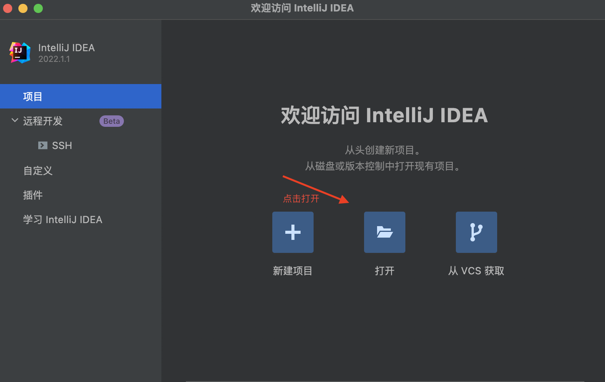
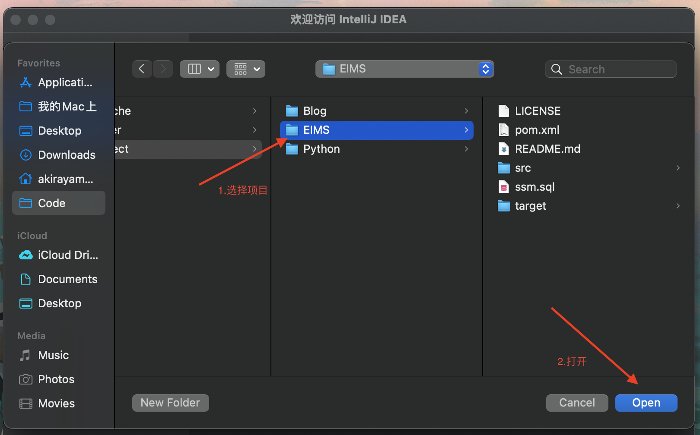

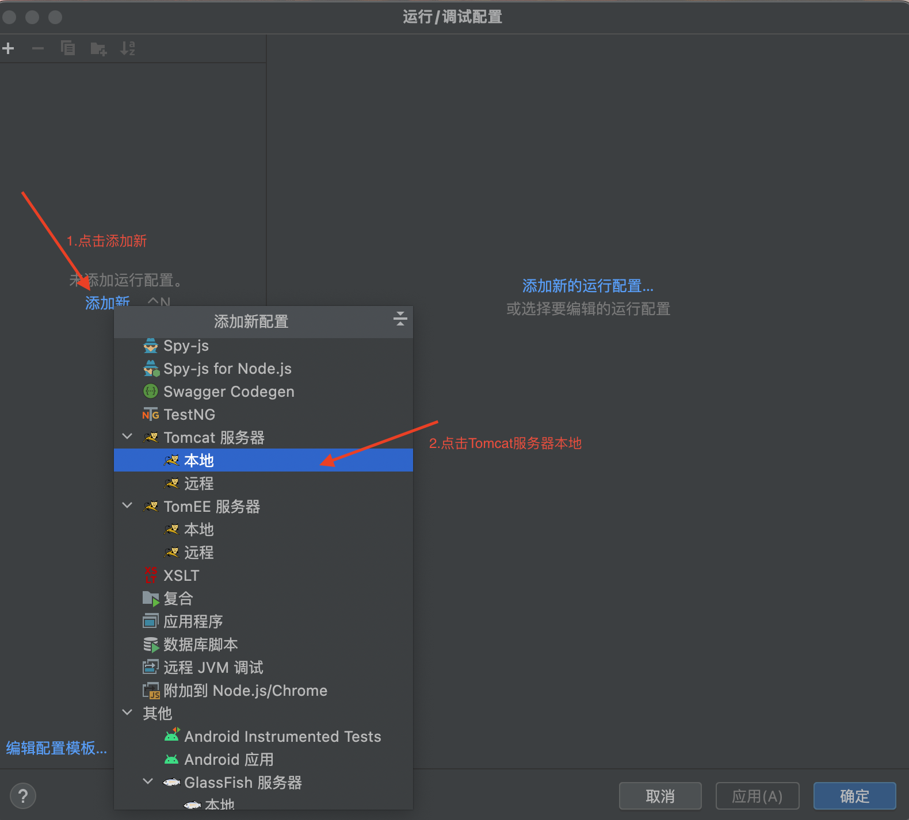
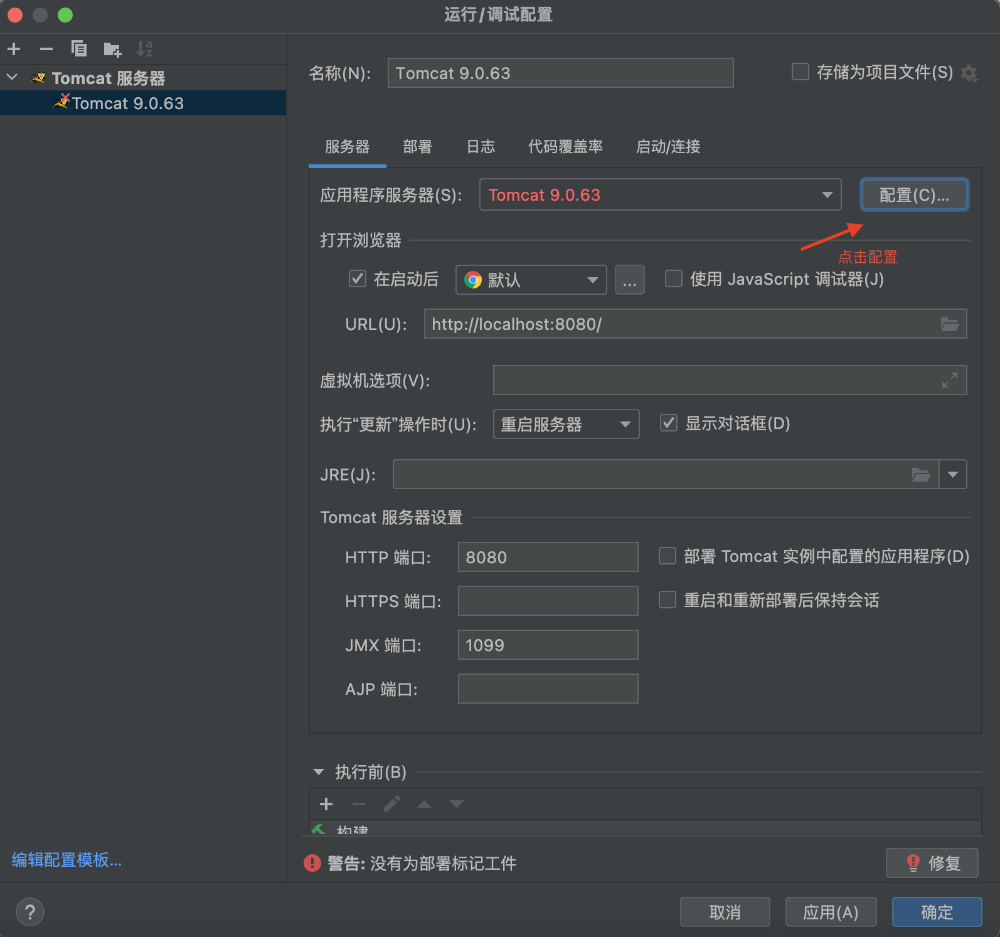
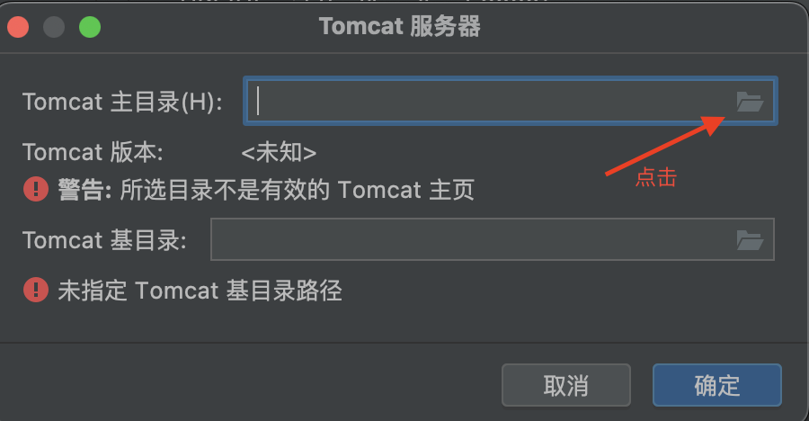
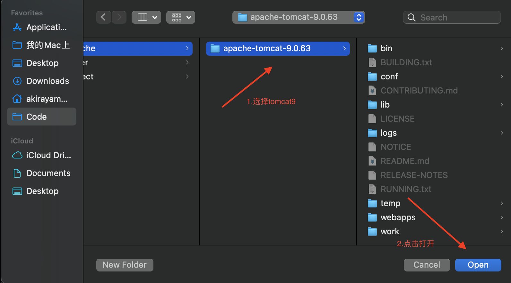
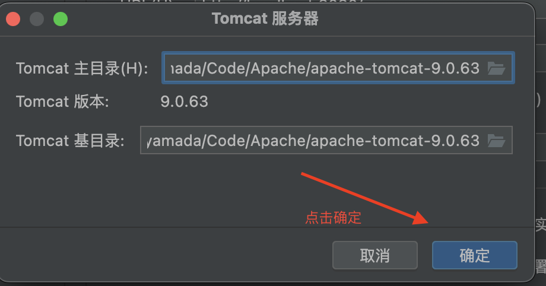
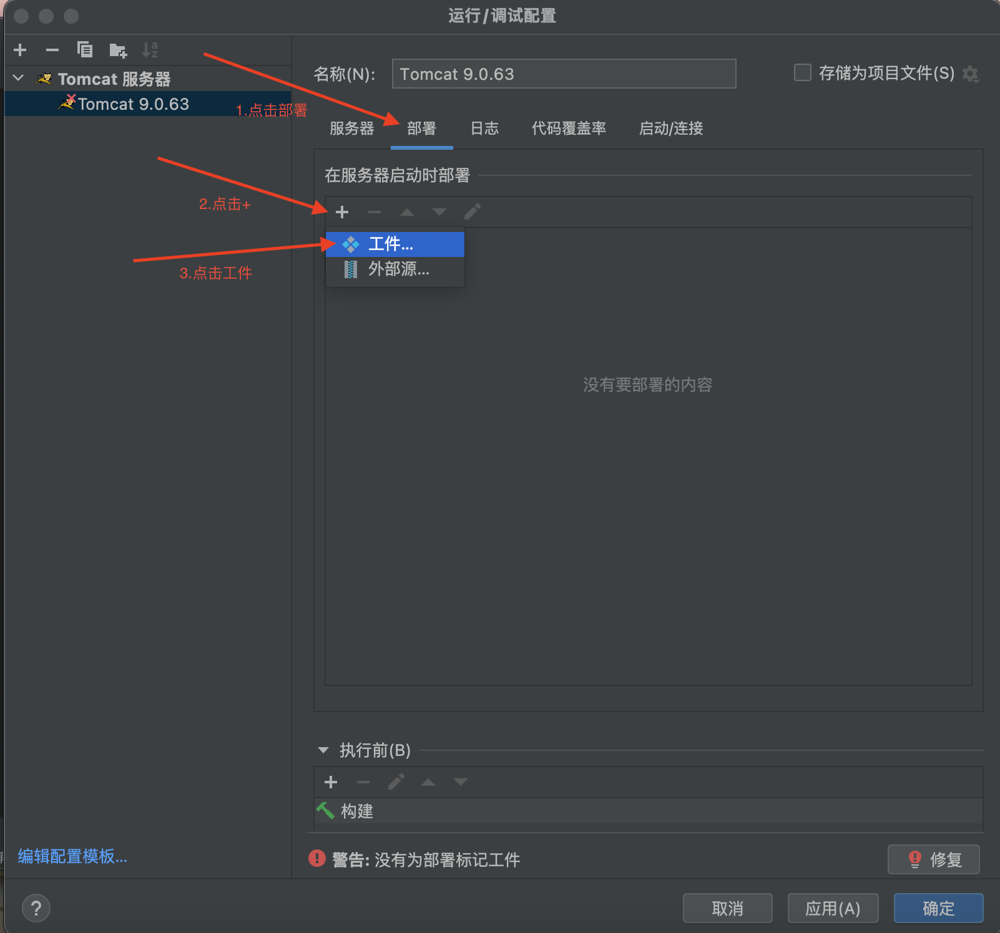

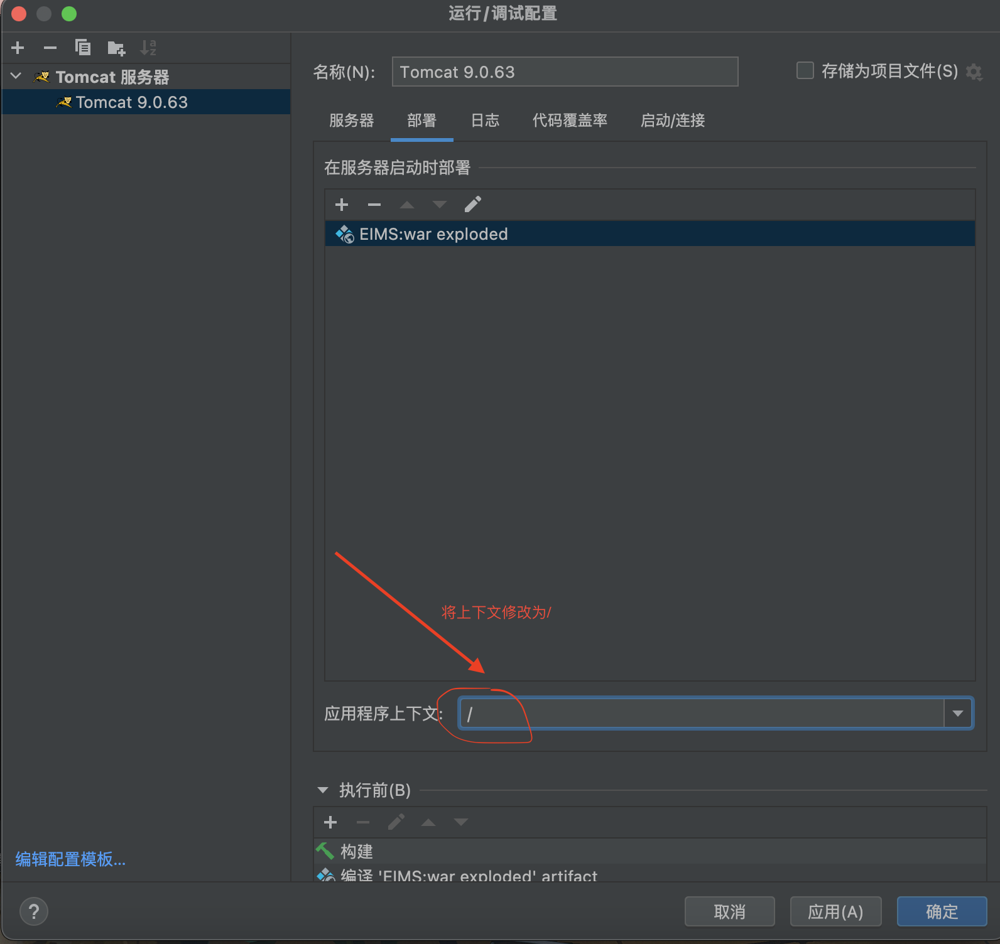
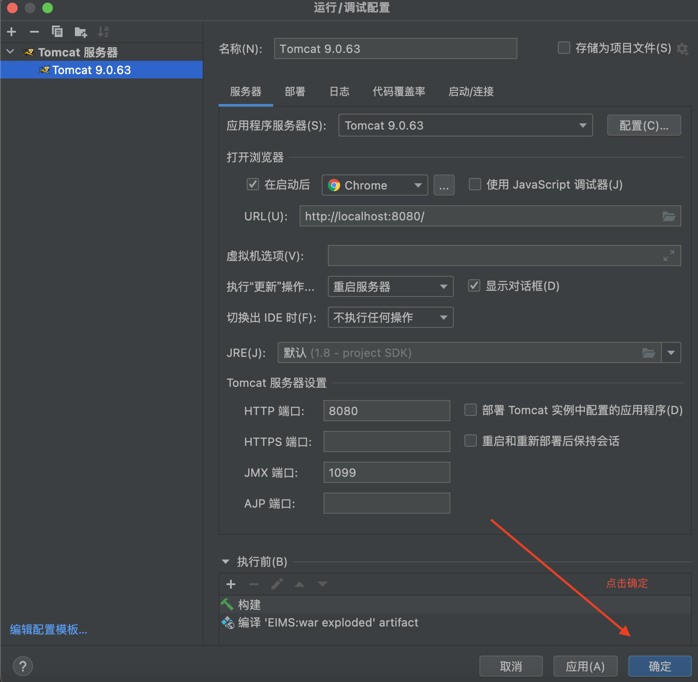
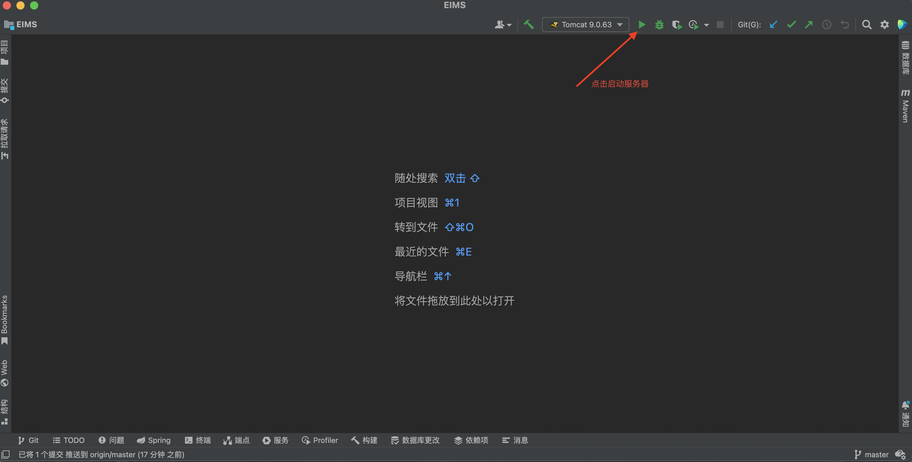